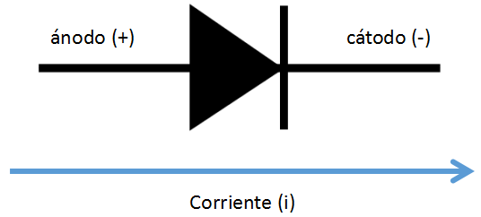

2024-09-30 17:06

Tags: #Analoga #Diodos

Elemento de 2 terminales semiconductor con el siguiente símbolo:

La ecuación del Diodo para el diodo cuando esta en **polarización directa**.
$$\LARGE I_{D}= I_{S}(e^{\frac{V_{D}}{nV_{T}}}-1)$$

Donde cada parámetro corresponde a:
* _ID (Corriente del diodo)_ : Cuando esta **polarizado en directa**.
* _IS (Corriente de Fuga)_: Corriente extremadamente pequeña cuando esta **polarizado en inversa**. Depende de la temperatura y características del diodo (Constante).
* _VD (Voltaje a través del diodo)_ : Este voltaje en **polarización directa** es fijo (0.1 v - 0.8 v). En **polarización inversa** depende del circuito y es negativo (Desde Ánodo hasta Cátodo).
* _VT (Voltaje térmico) :_ Parámetro establecido por la temperatura, dado por la siguiente ecuación:

$$ V_{T} = \frac {kT}{q} $$

Con k = constante de Boltzmann (1.38 x 10^-23 J/K)  ||  T = temperatura en Kelvin || q = Carga del electrón (1.6 x10^-19 C). 

* _n (Factor de Idealidad)_ : Idealmente seria de 1, no obstante, el valor suele rondar entre 1 -2 . Define la capacidad de emisión del diodo.
![[E.Analoga.pdf]]