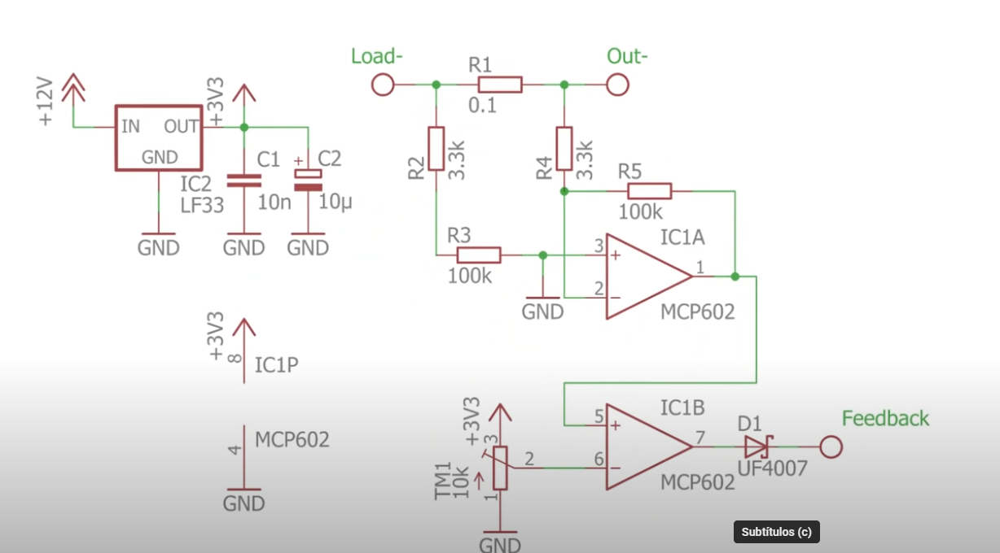
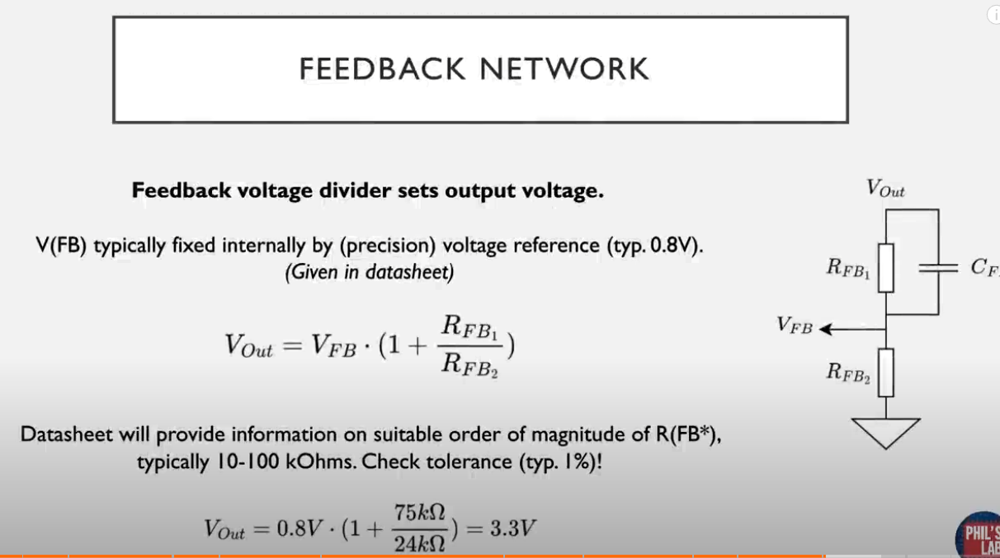

2024-10-19 16:15

Tags: #Topologia #Potencia 

# Primer Video

### Esquemático

---

# Segundo Video

*  _IC para regulacion y conmutacion:_  LM2587S ->Simple switcher 5A flyback regulator
Para limitar la corriente se realiza un circuito que va hacia el terminal de feedback del IC. Para eso:

---
# Tercer Video

Pasos para diseño Buck simple-> Escoger _IC_: 
* Establecer rango de operacion voltaje entrada
* Determinar voltaje de salida
* Determinar maxima corriente de salida

[DC/DC Converters – Mouser](https://www.mouser.com/c/power/dc-dc-converters/?srsltid=AfmBOorSJ_temlc_aFRMOY-lKa8-2LfH7ot_4R8Su2WBiLWjtNTFclX-)

Pagina para mirar diferentes _IC_.

Despues se necesita hallar la corriente maxima de conmutacion:
* Calcular _Duty Cycle_ 
* Calcular el _rizado de corriente de inductor_
* Comparar con _IC_ seleccionado.
* Calcular picos de corriente.
* Seleccionar inductor de acuerdo a esto.

Revisar datos nominales de los demas elementos.

---
# Cuarto video

Para el flyback se manera es un acomplamiento de inductancias, no como tal un transformador. La diferencia es que se posiciona un diodo de manera que la energia se almacene en el nucleo del transformador.

### Revisar con mas cuidado.

--- 

# Quinto Video

