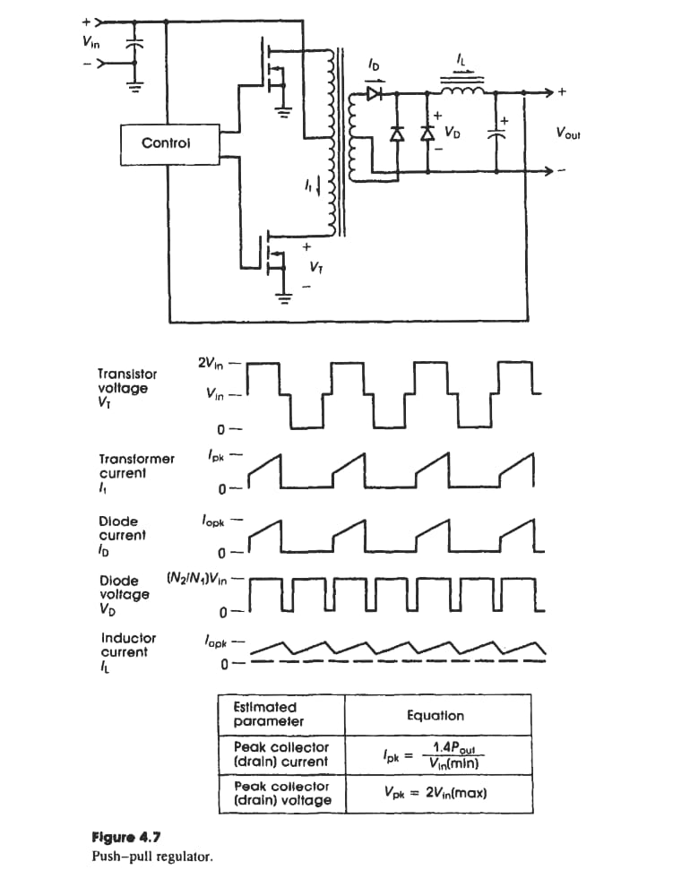

2024-10-14 17:04

Tags: #Topologia #Potencia 

Circuitos que trabajan a baja potencia incluyendo _Pump Circuits_.  
**Incovenientes:** 
* Dependencia de _Vout_ en _Vin_.
* Alto voltaje ripple _Vrrp_
* Baja ganancia de Voltaje.
Para aumentar la ganancia de voltaje se usan conversores con transformadores.
### Transformer Type Pumps
Todos poseen en común el uso de un interruptor electrónico, un diodo, un capacitor y un transformador. Todos tienen mejor ganancia de voltaje ya que depende del embobinado.

---
#### Fly-back pump converter regulator
Basado en el _Demagnetizing Effect_. Garantiza que:
* Mas de una posible salida desde un unica entrada
* Voltajes positivos o negativos
* Independencia de los voltajes
* Aislamiento y proteccion
* Trabajo en modo continuo y discontinuo
* Almacena energia

--- 

#### Push - Pull Converter regulator
Para evitar la saturacion magnetica del nucleo ferromagnetico de un transformador con tap central en primario y secundario. _Especial cuidado con los tiempos de conmutacion para evitar cortos._

General Features:

* No almacena energia
* Aislamiento y proteccion
* Mas eficiente en el uso del nucleo magnetico -> Transformador mas pequeño.
* Mayor ganancia
* Maneja potencias mayores
* 

---

#### Half bridge converter
Se busca tener un unico embobinado primario.
* Mejor balanceo en el nucleo del transformador.
* 

#### Full bridge converter

---

#### Forward Pump
Se suele añadir un embobinado adicional para aumentar la capacidad magnetica del transformador:

#### Foward Converter con multiples salidas

