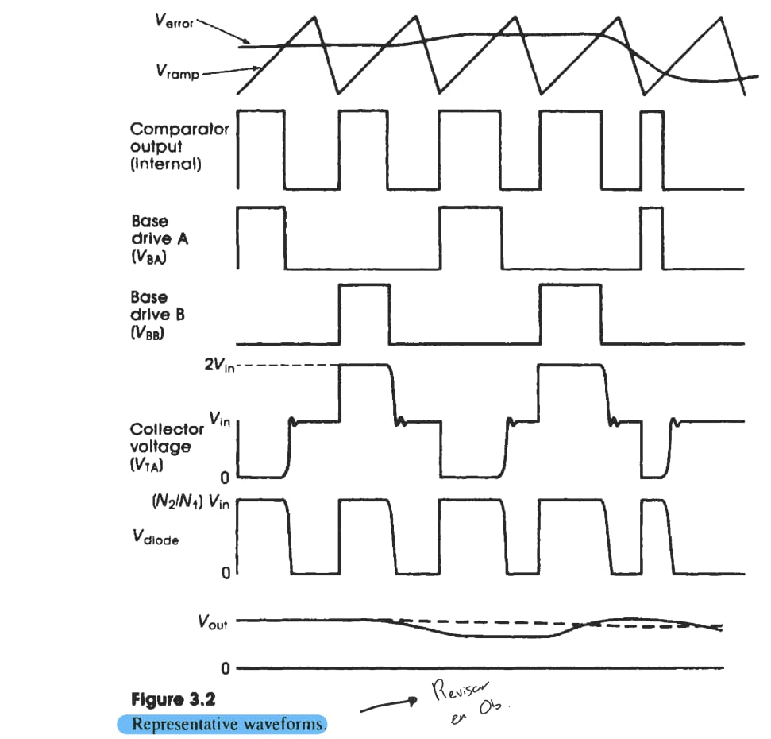

2024-10-15 16:25

Tags: #Potencia #Topologia 

	Filtros _LC_ funcionan como filtros de _HFRFI (High Frecuency Radio Interference)_ . 

La **frecuencia de filtro** no debera ser 2 - 3 veces mas que la frecuencia de la fuente. A su vez, añade una impedancia inductiva entre la fuente y _Bulk filter Capacitor_, lo que reduce transientes peligrosos de corriente y voltaje.

---
### Diagrama general switcheo

---
Por otro lado, el _Bulk filter Capacitor_ se refiere a un elemento con la funcion de almacenar energia de alta - baja frecuencia usada por la fuente en cada ciclo de los transistores. Se conforma usando:

* Capacitor electrolitico para componentes harmonicos de la corriente de _supply's switching frequency_.

* Capacitor ceramico para los harmónicos de la _frecuencia de conmutacion_.

En general:
* Brinda estabilidad al sistema.
* Filtra el rizado y componentes armonicos. 
* Mejor eficiencia.

### Shunt Capacitor

- **Función**: Se conecta en paralelo (shunt) para:
  - Mejorar el **factor de potencia** compensando cargas inductivas.
  - **Reducir pérdidas** de energía.
  - Mantener el **voltaje estable**.
  - **Filtrar armónicos** en algunos casos.

- **Aplicaciones**:
  - Líneas de transmisión y sistemas industriales.
  - Estabilización de voltaje en sistemas de distribución.
### Series Inductor

- **Función**: Se conecta en serie para:
  - **Almacenar energía** en forma de campo magnético.
  - Actuar como **filtro de corriente**, bloqueando señales de alta frecuencia.
  - **Limitar corrientes** de arranque.
  - Compensar **reactancia capacitiva** en líneas de transmisión.

- **Aplicaciones**:
  - Filtrado de señales en fuentes de alimentación.
  - Suavizado de corriente en fuentes conmutadas.
  - Corrección del factor de potencia capacitivo.

Todo esto usado para los filtros LC.

### Elementos Current Sense

Desarrollar voltaje proporcional a la corriente de salida de la carga. En caso de que se genere una _sobrecorriente_ por un voltaje muy alto, el sistema fuerza la reduccion del voltaje.

* _Voltage mode regulatos_ : Se activa al detectar una sobre corriente. (Current foldback limiting)
* _Current mode regulators_ : Se mide la corriente del primerio del transformador y se usa para la limitacion de la corriente. 
---

	Current Foldback limiting : Tecnica de proteccion usado en fuentes que limita la corriente de salida.

---
### Elementos Voltage Feedback

Usualmente un divisor de tension que reduce el _voltaje de salida_ a un voltaje de referencia entre la entrada y un _amplificador de error de voltaje_