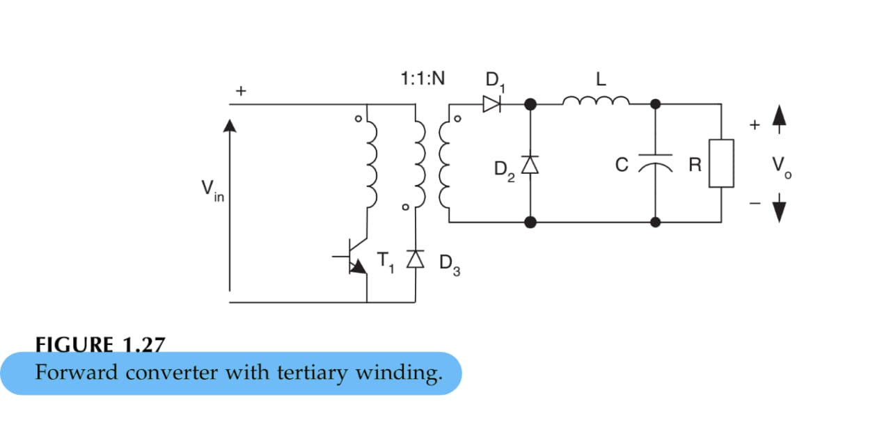

2024-10-14 17:04

Tags: #Topologia #Potencia 

Circuitos que trabajan a baja potencia incluyendo _Pump Circuits_.  
**Incovenientes:** 
* Dependencia de _Vout_ en _Vin_.
* Alto voltaje ripple _Vrrp_
* Baja ganancia de Voltaje.
Para aumentar la ganancia de voltaje se usan conversores con transformadores.
### Transformer Type Pumps
Todos poseen en común el uso de un interruptor electrónico, un diodo, un capacitor y un transformador. Todos tienen mejor ganancia de voltaje ya que depende del embobinado.

* Forward Pump
Se suele añadir un embobinado adicional para aumentar la capacidad magnetica del transformador:

* Push - Pull Converter
Para evitar la saturacion magnetica del nucleo ferromagnetico de un transformador.  Como se generan basicamente 2 salidas de la conversion magnetica, la topologia se usa usualmente para _Boost_.

* Fly-back pump
Basado en el _Demagnetizing Effect_ 

* Zeta Pump

* Half bridge converter

* Full bridge converter

