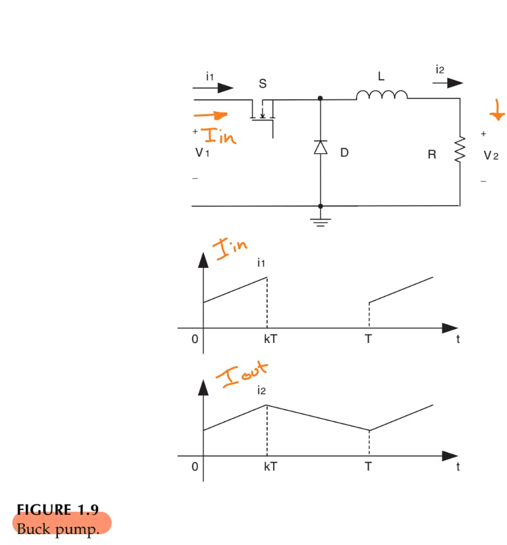
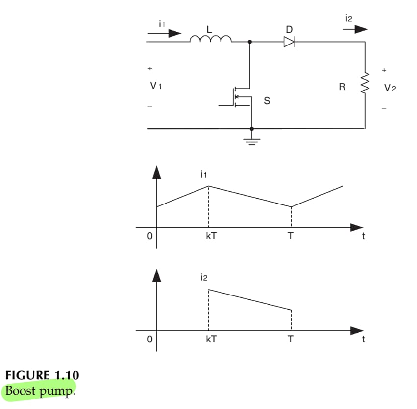
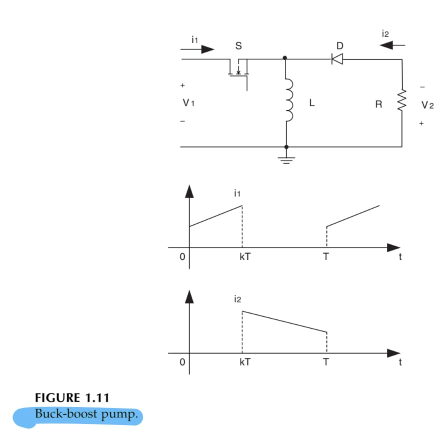
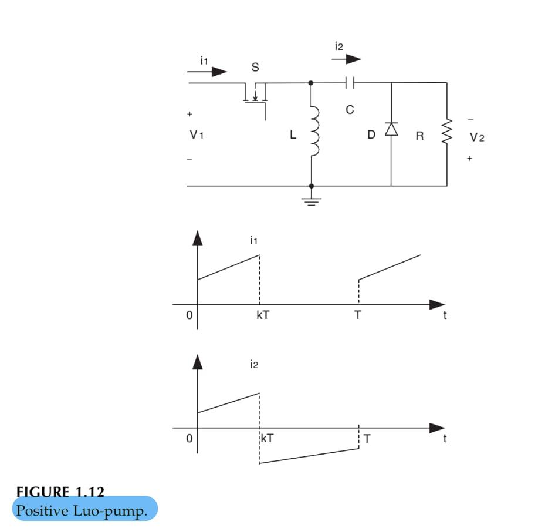
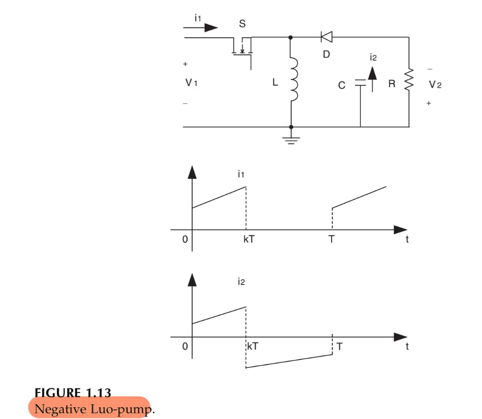
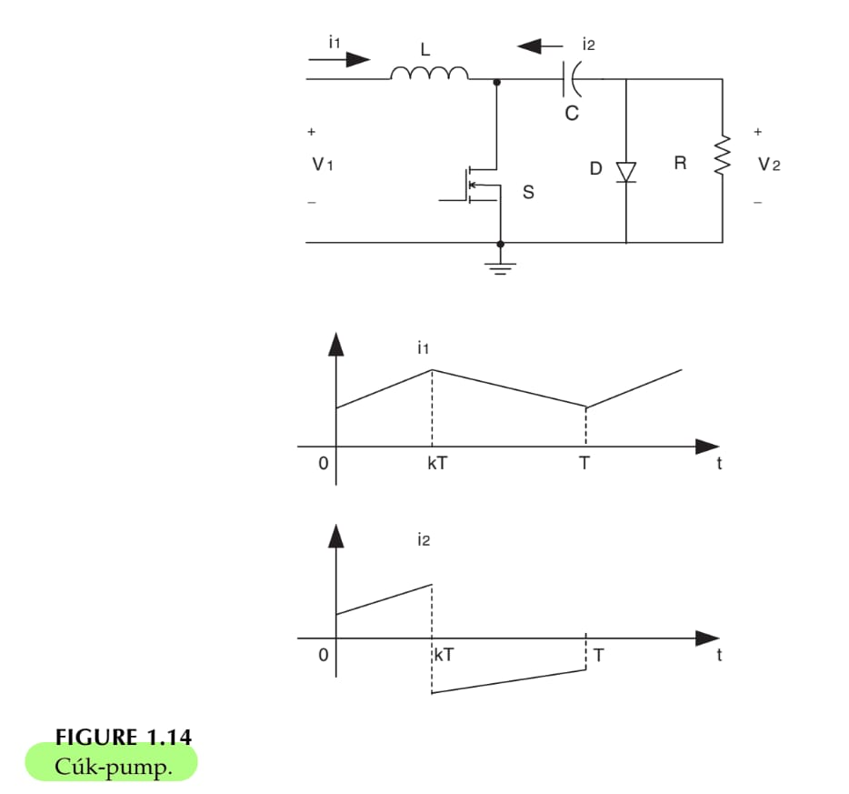
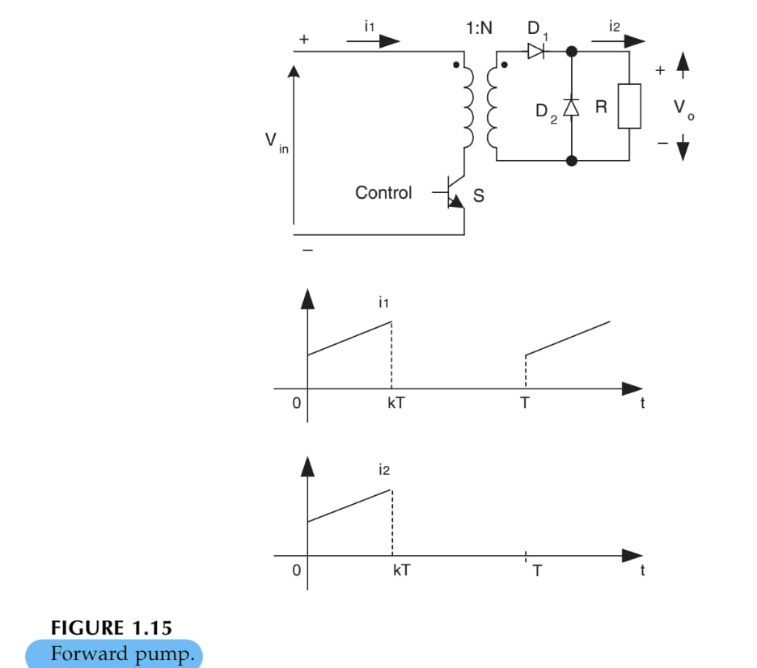
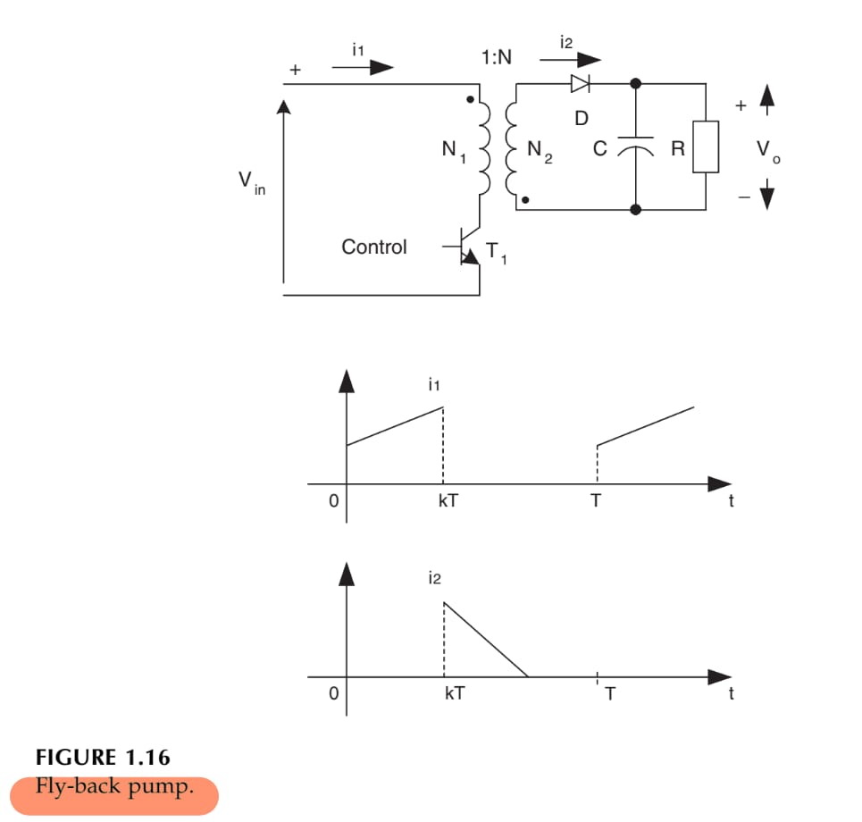
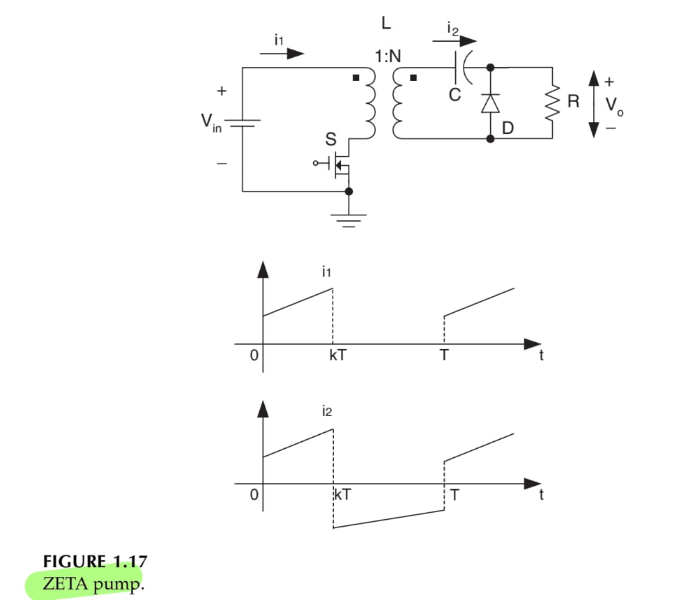

2024-10-09 21:04

Tags: #Potencia #Topologia 

Estos circuitos se pueden dividir en 4 grupos:
* Fundamental pumps
* Developed pumps
* Transformer type pumps
* Super lift pumps
### Fundamental Pumps
Todos poseen en comun el uso de un interruptor electrónico, un diodo y un inductor.
* Buck pump

* Boost pump

* Buck-boost pump

### Developed Pumps
Todos poseen en comun el uso de un interruptor electrónico, un diodo, un capacitor y un inductor.
* Positive luo pump
Trabaja en operacion continua, la corriente _Iout , Vout > 0_.

* Negative luo pump
Trabaja en operacion continua, la corriente _Iout , Vout < 0_.

* Cuk pump
Trabaja en operacion continua, la corriente _Iout , Vout < 0_.

### Transformer Type pumps
Todos poseen en común el uso de un interruptor electrónico, un diodo, un capacitor y un transformador.
* Foward Pump
S1 y el D1 sincronizados y D2 con sincronización contraria. Modo de operación discontinuo.

* Fly-back pump
S y D alternativamente sincronizados, trabajando en modo discontinuo.

* Zeta Pump
S y D alternativamente sincronizados, trabajando en modo discontinuo.

