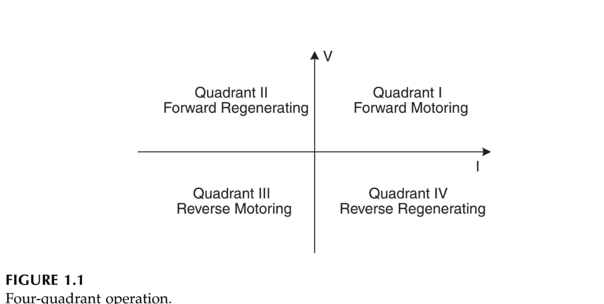

2024-10-08 21:22

Tags: #Potencia #Motor #DC  

Tiene 2 funcionamientos basicos de acuerdo a la direccion de giro.
### Foward Running : 
El voltaje de armadura y corriente son positivas dando giro en la direccion _"Normal"_ (Foward Motoring Operation en el cuadrante **1**). **+V , +A** 

### Foward Bracking:
El voltaje de armadura es positivo pero la corriente es negativa y se frena el motor en su dirección _"Normal"_ (Foward regenerating operation en el cuadrante **2**) **+V , -A**.

### Reverse Starting:
El voltaje de armadura y corriente son negativos dando giro contrario a la direccion _"Normal"_ (Reverse starting en el cuadrante _3_) **-V , -A**.

### Reverse Braking:
El voltaje de armadura es negativo y la corriente es positiva dando giro contrario a la direccion _"Normal"_ (Reverse regenerating Operation en el cuadrante _4_) **-V , -A**.

## Choppers 

Interruptor electronico (generalmente transitor de potencia) que regula el flujo de una _fuente de corriente DC_ hacia una carga. El chopper seria un interruptor electronico (Mosfet o IGBT) que por medio de su conmutacion varia el _Ducy Cycle DT_ (varia la energia que pasa a la carga) 