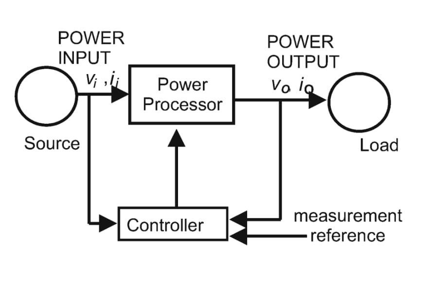
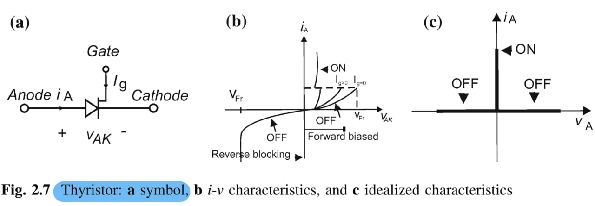
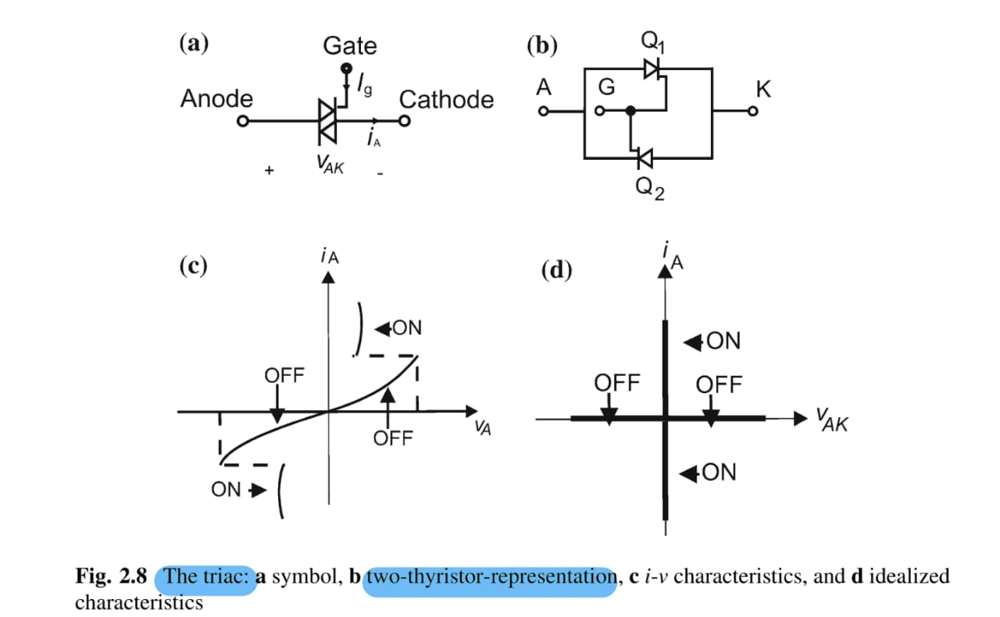

2024-10-03 17:08

Tags: #Fluss #Potencia #Electronica

Los circuitos de potencia existen con el fin de convertir potencia a diferentes formas (AC/DC).
Se divide en 2 módulos primordiales:
* Fase de control _(Control Stage)_ .
* Fase de potencia _(Power Stage)_. 

Se tienen diferentes elementos que se usan para la conexión de ambas fases. 
### BJT
Usado en aplicaciones de baja / media potencia y frecuencia (Poco usado hoy en dia).
### MOSFET
Usado en aplicaciones de _switching_ en baja potencia y alta frecuencia.
### GTO (Gate turn-off Thyristor)
Usado en aplicaciones de media / alta potencia, baja / media frecuencia.
### IGBT (Insulated gate bipolar transistor)
Usado en aplicaciones de baja / media potencia y frecuencia.
### IGCT (Integrated gate commutated thyristor)
Usado en aplicaciones de media / alta potencia, baja / media frecuencia.

* **Convertidor de potencia -> DC**
* **Transformador -> AC**

## Switches PE

Un switch ideal PE se define como un elemento de 3 terminales; _in_ , _out_ y _control_ que tiene un consumo de 0 Watts.

## Tipos de switches

Se asume una tensión  _0 V_ , una corriente de fuga de _0 A_ y un cambio instantáneo de estado. Se clasifican como:
* Uncontrolled switch: Sin terminal de control. _(Diodo)_
* Semi-controlled switch: Con terminal de control pero limitacion en su accionar _(SCR / Thyristor)._
	En el caso de un _Thyristor_ por el terminal de control se puede "prender" permitiendo el paso de corriente (Funcionando como un diodo), no obstante, no se puede apagar sin un circuito adicional. 

		Dispositivo PNPN
	
	
	
	Adicionalmente, un _Triac_ puede ser modelado como 2 _Thyristors_, haciendo que sea tenga un dispositivo bidireccional de corriente para aplicaciones de baja potencia y fase unica (Motores de unica fase).
	
	 

	
* Controlled switch: Con terminal de control y control de apagado y cerrado _(BJT , MOSFET , IGBT , GTO THYRISTOR  MCT)_

	SCR: silicon controller rectifier.

