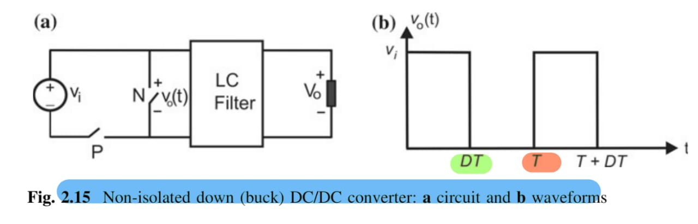
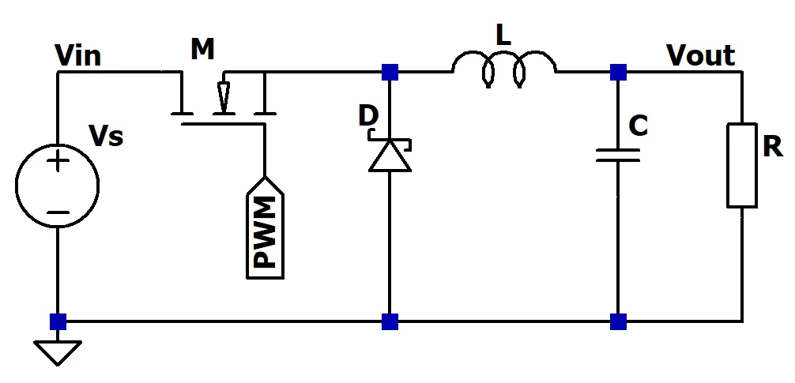
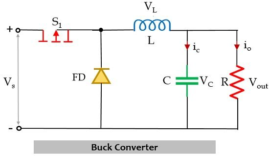

2024-10-04 01:09

Tags: #Fluss #Potencia 

Un convertir de potencia electronico son en general circuitos de conmutacion semiconductora con 4 formas generales:
### DC / DC Converter (Switching Regulator) : 
Convierte el nivel de _Vin_  a un nuevo nivel _ßVout_ con _ß>0_.
#### Non - isolated buck converter (Step-down converter)
Esquema mas simple de este convertidor:

Si se controla el switcheo en un periodo _T_ , la salida _Vo = Vin_ cuando **P-switch On** y _Vo = 0_ cuando **N-switch On** . El tiempo de prendido sera determinado por el __ciclo de trabajo(Dt)__ y __T__.  Como la onda resultante es pulsante se usa un filtrado LC a DC estable, siendo que se trabaja un el voltaje promedio de la onda:
$$
\LARGE V_{avg}=\frac {1}{T}​ \int_{0}^{DT} V_{i} =DV_{i}
$$
Como _Dt < 1_ la salida DC siempre sera menor a la entrada. Circuito basico general de buck converter:

#### CON ZENER

#### SIN ZENER

El comportamiento varia de acuerdo al diodo usado.  En el caso de un diodo normal, solo se tiene el circuito buck sin regulación de voltaje. Por otro lado, el diodo zener permite tener protección contra sobre voltajes y asegura un voltaje máximo (regulación de voltaje).

### DC / AC Converter (Inverter):
Convierte un nivel _Vin_ AC de entrada a una onda cualquiera AC.

### AC / DC Converter (Rectifier) :
Convierte una señal _Vins_ AC de entrada a un nivel _Vout_ DC de salida. 
(Causa armonicos y bajo FP)

### AC / AC converter (AC controllers and Cycloconverters):
Si convierte una señal _Vins_ AC cambiando unicamente la **amplitud** -> AC controller.

	(FVFF) -> Fixed Voltage Fixed Frecuency
	a (VVFF) -> Variable Voltage Fixed Frecuency

Si convierte una señal _Vins_ AC cambiando la **amplitud** y **frecuencia** -> Cycloconverter.

	(FVFF) a (VVVF) -> Variable Voltage Variable Frecuency

Si en la topología se usan _Controlled switches_  se le llama **Matrix Converter**.
