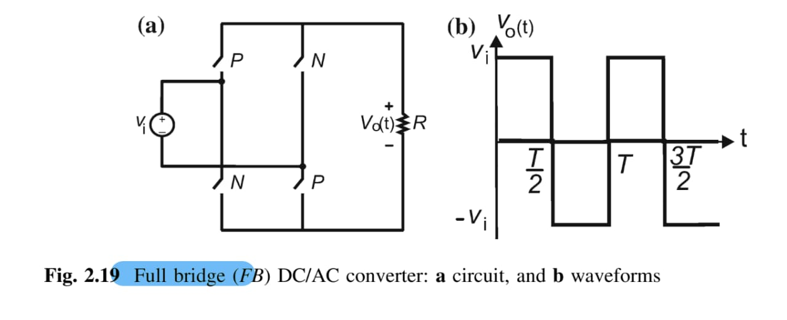

2024-10-04 18:14

Tags: #Fluss #Potencia #Topologia 

Convierte un nivel _Vin_ DC de entrada a una onda cualquiera AC. Existe tanto para una fase como polifásico y _half bridge Converters_ / _Full Bridge Converters_.
### Single - Phase Converter 

Representacion mas simple **Full-bridge**:

Al activar unicamente los _P-Switches_ se tiene un ciclo positivo de la onda, posteriormente, al activar unicamente los _N-Switches_ se tiene un ciclo negativo de la onda.  Lo que corresponde a un _Dt = 0.5_.

Representacion mas simple _Half-bridge_ :

