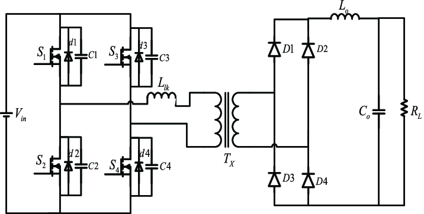

2024-10-04 01:09

Tags: #Fluss #Potencia #Topologia
## DC / DC Converter (Switching Regulator) : 
Convierte el nivel de _Vin_  a un nuevo nivel _ßVout_ con _ß>0_.
### Non-isolated buck converter (Step-down converter) (Convencional)
Esquema mas simple de este convertidor:

Si se controla el switcheo en un periodo _T_ , la salida _Vo = Vin_ cuando **P-switch On** y _Vo = 0_ cuando **N-switch On** . El tiempo de prendido sera determinado por el __ciclo de trabajo(Dt)__ y __T__.  Como la onda resultante es pulsante se usa un filtrado LC a DC estable, siendo que se trabaja un el voltaje promedio de la onda:

$$
\LARGE V_{avg}=\frac {1}{T}​ \int_{0}^{DT} V_{i} \,\,\,dt=DtV_{i}
$$

Como _Dt < 1_ la salida DC siempre sera menor a la entrada. Circuito basico general de buck converter:

##### CON ZENER

##### SIN ZENER

El comportamiento varia de acuerdo al diodo usado.  En el caso de un diodo normal, solo se tiene el circuito buck sin regulación de voltaje. Por otro lado, el diodo zener permite tener protección contra sobre voltajes y asegura un voltaje máximo (regulación de voltaje).

### Full bridge non-isolated down (Buck)
Esquema mas simple de este convertidor:

En vez del uso de un único transistor para controlar la corriente, se usan 4 transistores que crean 2 posibles flujos de corriente, uno positivo y uno negativo. Cuando **P_Switches ON** se tiene que _Vo =Vin_ y cuando **N-Switches ON** se tiene que _Vo=-Vin_.  Esto produce una señal cuadrada como la de la imagen, que pasa por un filtro LC (como filtro harmónico) para finalmente obtener en _Vo_ el voltaje promedio dado por la siguiente expresión:

$$ 
\LARGE V_{avg } = [\int_{0}^{DT} V_{i} \,\,\, dt \,\,\,+ \,\,\,\int_{DT}^{T} -V_{i}\,\,\,dt ]
$$

Donde _Dt > 0.5_ se tiene un ciclo positivo y en _Dt < 0.5_ un ciclo negativo. 
## Diferencias: 
| Característica             | Non-Isolated Buck Converter        | Full-Bridge Non-Isolated Buck Converter |
| -------------------------- | ---------------------------------- | --------------------------------------- |
| **Número de transistores** | 1                                  | 4                                       |
| **Configuración**          | Convencional, simple               | Puente completo (Full Bridge)           |
| **Complejidad**            | Baja                               | Alta                                    |
| **Control de la señal**    | Señal PWM para un solo interruptor | Señal PWM para un puente completo       |
| **Aplicaciones**           | Baja y media potencia              | Aplicaciones de alta potencia           |
| **Eficiencia**             | Moderada                           | Alta                                    |
| **Tamaño y costo**         | Menor                              | Mayor                                   |

### Full bridge Buck converter isolated 

### Full bridge Buck converter non-isolated 

## Reguladores de voltaje

### LM317T
Regulador lineal ( Disipa el exceso de energia en calor ) con _eficiencia del 30% -60%_.
* Entrada 3 V - 40 V
* Salida 1.25 V - 37 V
* Corriente salida 1.5 A max
### LM2596S
Regulador conmutado tipo buck (Mosfet) con _eficiencia del 80% - 90%_.
* Entrada 4.5 V - 40 V
* Salida 1.23 V - 37 V
* Corriente salida 3 A max
* Frecuencia de conmutación 150 kHz
### XL4016E
Regulador conmutado tipo buck (Mosfet) de alta corriente con _eficiencia del 85% - 95%_.
* Entrada 8 V - 40 V
* Salida 1.25 V - 36 V
* Corriente salida 8 A max (5A -> Disipadores) (8 A -> Refrigeracion adicional)
* Frecuencia de conmutacion 180 kHz
* Incluye protecciones.
### Xh-m401 (Modulo)
Circuito pre-ensamblado que usa **XL4016E** con capacidad de ajuste de la salida desde un potenciómetro .
